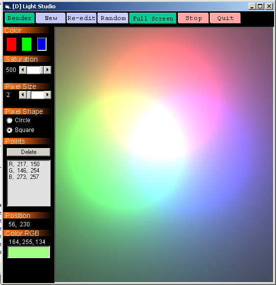



## Light Studio

### Description

This program simulates the inverse square law of light. To do so, the program gives you an empty (2D) space to place light sources. These sources can be either red, green, or blue. The user can place multiple light sources of any color.

The result.. A program which can produce very interesting colorful outputs by just randomly placing light sources. Moreover, once rendered, the program gives you the RGB component of any pixel present in the output. Thus you like a color, take the RGB value to any other program and reproduce it :)

Once this is done, the program can simulte(upon pressing render) how these light sources will mix and match and produce an output. The screen shot has been prepared by placing 1 green, 1 blue, and 1 red light sources.
 
### More Info
 
This program does not treat the inverse square law of light emperically. Rather the law is made to work for this program only. Hence the constants or relationships are not consistent with those observed in the real world.

             |
---                |---
**Submitted On**   |2001-11-13 18:28:08
**By**             |[Danish Mujeeb](https://github.com/Planet-Source-Code/PSCIndex/blob/master/ByAuthor/danish-mujeeb.md)
**Level**          |Intermediate
**User Rating**    |4.9 (49 globes from 10 users)
**Compatibility**  |VB 5\.0, VB 6\.0
**Category**       |[Graphics](https://github.com/Planet-Source-Code/PSCIndex/blob/master/ByCategory/graphics__1-46.md)
**World**          |[Visual Basic](https://github.com/Planet-Source-Code/PSCIndex/blob/master/ByWorld/visual-basic.md)
**Archive File**   |[Light\_Stud3504011132001\.zip](https://github.com/Planet-Source-Code/danish-mujeeb-light-studio__1-28869/archive/master.zip)

